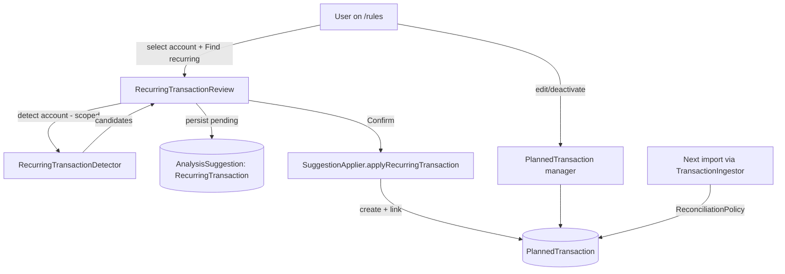

# Recurring Review on /rules — detect, confirm to plans, manage — Design

- **Date:** 2026-06-27
- **Status:** Approved (design phase)
- **Author:** brainstorming session (robwilde + assistant)
- **Tech stack:** PHP 8.4, Laravel 12, Livewire 3 + Flux, Pest 4. Runs in DDEV (`op test*`). No new packages. **No schema migration.**

## Goal

Give the user an on-demand workflow on the `/rules` page to: pick an account, scan its
existing transactions for recurring patterns, review the candidates, confirm the ones
they want into **planned transactions**, and edit/manage those planned transactions from
the same page. Once a planned transaction exists, future imports are matched to it
automatically by the existing reconciliation path — no per-pattern rule is generated.

This is the deferred follow-up explicitly tracked out of epic #281:
> "Rewiring recurring detection into the user rule system (currently paused behind
> `budget.recurring_detection`, default off) — should be tracked as its own issue when
> picked up."

## Decisions (resolved during brainstorming)

| Fork                               | Decision                                     | Why                                                                                                                                                                                                                                                                    |
|------------------------------------|----------------------------------------------|------------------------------------------------------------------------------------------------------------------------------------------------------------------------------------------------------------------------------------------------------------------------|
| What a confirmed pattern generates | **Planned transactions only**                | `ReconciliationPolicy` already matches future imports to plans (±10% amount, ±3 days, same account+direction). A second matching path (auto-`UserRule`) would duplicate that and risk double-linking. The `UserRule` engine stays for manual field→action automations. |
| Trigger                            | **On-demand from `/rules` only**             | Matches the "a function I can run" framing; predictable and user-controlled. Import-time auto-detection stays behind `budget.recurring_detection` (off).                                                                                                               |
| Scope per scan                     | **One account at a time, default = primary** | Matches "for a specific account"; the just-imported primary account is the obvious default.                                                                                                                                                                            |

## What already exists (as-found — this is wiring, not new detection)

The detection algorithm the user described is **already implemented**, behind the
`budget.recurring_detection` flag (off):

- **Description grouping** — `App\Support\Recurring\MerchantSignature::for()` normalises a
  description to its stable payee words, stripping reference/account/direct-debit codes
  and trailing numeral codes (`DT.4y16g4`, `Ref#…`, `bcx:int…`). Handles "same prefix,
  differing trailing numeral".
- **Amount variance** — `IdentifyRecurringTransactionsStage::dominantCluster()` clusters
  amounts within ±50¢ or ±2% (whichever larger), surviving outliers/step-changes.
- **Cadence** — `FREQUENCY_TARGETS` snaps the median interval to 7 / 14 / 21 / 30 / 91 /
  182 / 365 days → `RecurrenceFrequency`, plus confidence scoring and a noise filter
  (round-ups, internal own-account transfers).
- **Confirm → plan** — `App\Services\SuggestionApplier::applyRecurringTransaction()`
  already turns an accepted `AnalysisSuggestion(RecurringTransaction)` into a
  `PlannedTransaction` and links the matched transactions.
- **Future-import matching** — `ReconciliationPolicy` (single source of truth) matches at
  ingress (`TransactionIngestor`) and as an async backstop (`PlannedTransactionMatcher` /
  `MatchPlannedTransactionsStage`). **No new matching code is required.**
- **The page** — `/rules` already mounts `<livewire:user-rule-manager />`
  (`resources/views/rules.blade.php`), a full CRUD UI for `UserRuleGroup` / `UserRule`.

The gaps are: detection only runs **import-time, all-accounts, flag-gated**; recurring
suggestions surface on **`connect-bank`**, not `/rules`; there is **no per-account
on-demand scan**, no bulk review→confirm, and **no planned-transaction editor** on `/rules`.

## Design

### 1. Extract an account-scoped detector (no behaviour change)

Pull the grouping / clustering / cadence / confidence / payload logic out of
`IdentifyRecurringTransactionsStage` into a reusable, unit-tested service:

```
App\Services\Recurring\RecurringTransactionDetector
    detect(User $user, ?int $accountId = null): Collection<RecurringCandidate>
```

- `RecurringCandidate` is a small DTO mirroring today's suggestion payload
  (description, clean_description, amount, direction, frequency, account_id, category_id,
  matched_transaction_ids, start_date, confidence_score).
- The loader gains an optional `accountId` filter; grouping already keys by `account_id`,
  so per-account is natural.
- `IdentifyRecurringTransactionsStage` is reduced to: call the detector (all accounts),
  apply the existing skip rules, persist `AnalysisSuggestion` rows. **Its behaviour and
  the `budget.recurring_detection` gate are unchanged** — existing tests stay green.

### 2. On-demand scan + review section on `/rules`

New Livewire component `App\Livewire\RecurringTransactionReview` embedded on `/rules`,
above (or beside) the existing rule-group manager.

- **Account selector** — defaults to `auth()->user()->primary_account_id`; lists the
  user's accounts.
- **"Find recurring" action** —
    1. Opens a `PipelineRun(trigger: Manual)` as the audit/FK anchor (avoids making
       `analysis_suggestions.pipeline_run_id` nullable → no migration).
    2. Runs `RecurringTransactionDetector::detect($user, $accountId)`.
    3. Applies the existing skip rules (already-accepted, existing-matching-plan,
       recently-rejected, noise) and persists pending
       `AnalysisSuggestion(RecurringTransaction)` rows for the candidates.
- **Review list** — one row per candidate: payee, amount, cadence, confidence, matched
  count, suggested category (editable inline, reusing `<x-category-combobox>`).
    - **Accept** (per-row and bulk "Confirm selected") → `SuggestionApplier::
    applyRecurringTransaction()` → creates the `PlannedTransaction`, links matched txns.
    - **Dismiss** → mark the suggestion `Rejected` (feeds the 90-day recently-rejected skip,
      so a re-scan won't nag).
- Re-scanning is idempotent: accepted patterns now have a matching plan and are skipped;
  rejected ones are suppressed for 90 days.

### 3. Planned-transaction manager on `/rules`

A section listing the selected account's **active planned transactions** (the recurring
"rules" in the user's words) with inline management:

- Columns: description, amount, direction, frequency, category, matched-transaction count,
  next occurrence.
- Edit (amount, frequency, category, direction, `is_active`, `until_date`), deactivate,
  delete. Pay-cycle income (`is_pay_cycle_income`) is shown read-only / badged so it isn't
  edited here (it is owned by `PayCycleConfigurator`).
- No new matching code: edits flow through the existing reconciliation + calendar/projection.

### Data flow



### Error handling

- Scan with no account / no transactions → empty-state ("No recurring patterns found").
- All confirm/edit/delete writes are user-scoped (`where('user_id', auth()->id())`) and
  wrapped in DB transactions (as `SuggestionApplier` already does).
- Concurrent re-scan is safe via the existing skip rules; a confirmed pattern cannot be
  re-suggested because a matching active plan now exists.

### Testing (Pest, TDD-first per task)

- **Detector unit tests** — extracted logic returns the same candidates as today for the
  real fixture CSVs; account filter scopes correctly; parity test vs. the stage.
- **Stage regression** — `IdentifyRecurringTransactionsStageTest` stays green (delegation).
- **Review component (Feature/Livewire)** — scan lists candidates; confirm creates an
  active plan + links matched txns + marks suggestion accepted; dismiss rejects; re-scan
  doesn't re-offer accepted/rejected; account scoping respected.
- **Planned manager (Feature/Livewire)** — edit persists; deactivate stops future matching;
  pay-cycle income is not editable here.
- Pint + PHPStan (excl. `tests/`) via GrumPHP before tests, per project workflow.

## Work items (epic + sub-tasks)

1. **refactor(backend):** extract account-scoped `RecurringTransactionDetector`; stage delegates (no behaviour/flag change).
2. **feat(backend/frontend):** on-demand "Find recurring" scan + review section on `/rules` (account selector default primary; confirm→plan via
   `SuggestionApplier`; dismiss→reject).
3. **feat(frontend/backend):** planned-transaction manager on `/rules` (list + inline edit/deactivate/delete for the account; pay-cycle income read-only).

## Sequencing

`#1 → #2 → #3`. #1 unblocks #2's on-demand detection. #3 depends only on existing
`PlannedTransaction` + the page scaffold #2 introduces, so it follows #2 for UI cohesion
but shares no detector code. Each lands as its own PR targeting `develop`.

## Out of scope (deferred)

- Re-enabling import-time auto-detection (`budget.recurring_detection` stays off).
- Auto-generating `UserRule`s from patterns (chose planned-only).
- Changing reconciliation tolerances or the matching algorithm.
- Basiq-specific UX (CSV-first, same code path).
- A GitHub Projects *board* (tracked as an Epic issue + sub-issues per repo convention #281).
